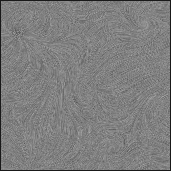

# Flow Visualization with LIC method
00957016 高敬庭  
## 完成內容
+ LIC method using box filtering  

## 已知問題
+ 19.vec在trace streamline時因數值計算過大會出界
+ test_not_unit.vec, test_unit.vec, step5_velocity.vec因為解析度過大，計算太慢無法產生
+ rect2.vec結果不明顯

## 結果
+ K = 50  
 
|1.vec|2.vec|3.vec|
|---|---|---|
||||

|4.vec|6.vec|9.vec|
|---|---|---|
||||

|13.vec|16.vec|rect2.vec|
|---|---|---|
||||